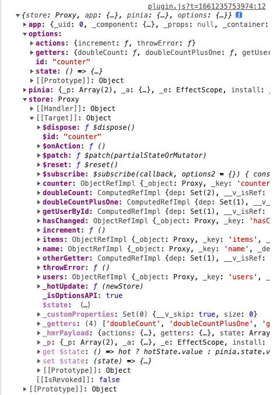

# pinia

This template should help get you started developing with Vue 3 in Vite.

## Customize configuration

See [Vite Configuration Reference](https://vitejs.dev/config/).

## Plugin
参数 context 结构  
